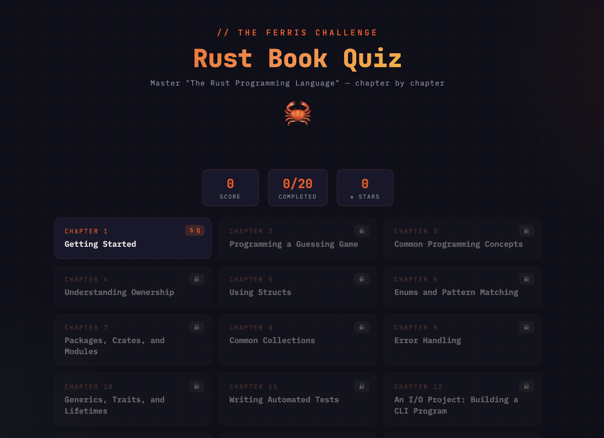

# 🦀 Rust Book Quiz — The Ferris Challenge

An interactive quiz game to test your knowledge of [_The Rust Programming Language_](https://doc.rust-lang.org/book/) (a.k.a. "The Book"), chapter by chapter.

**[▶ Play Now](https://YOUR_USERNAME.github.io/rust-book-quiz/)**



---

## What is this?

A single-page web app that turns each chapter of the official Rust Book into a 5-question quiz level. Work your way from "Getting Started" to "Advanced Features," earn stars, and track your progress — all in the browser with zero dependencies.

## Chapters covered

| Level | Chapter | Topic                                  |
| ----- | ------- | -------------------------------------- |
| 1     | Ch 1    | Getting Started                        |
| 2     | Ch 2    | Programming a Guessing Game            |
| 3     | Ch 3    | Common Programming Concepts            |
| 4     | Ch 4    | Understanding Ownership                |
| 5     | Ch 5    | Using Structs                          |
| 6     | Ch 6    | Enums and Pattern Matching             |
| 7     | Ch 7    | Packages, Crates, and Modules          |
| 8     | Ch 8    | Common Collections                     |
| 9     | Ch 9    | Error Handling                         |
| 10    | Ch 10   | Generics, Traits, and Lifetimes        |
| 11    | Ch 11   | Writing Automated Tests                |
| 12    | Ch 12   | An I/O Project: Building a CLI Program |
| 13    | Ch 13   | Iterators and Closures                 |
| 14    | Ch 14   | More About Cargo and Crates.io         |
| 15    | Ch 15   | Smart Pointers                         |
| 16    | Ch 16   | Fearless Concurrency                   |
| 17    | Ch 17   | Async and Await                        |
| 18    | Ch 18   | OOP Features of Rust                   |
| 19    | Ch 19   | Patterns and Matching                  |
| 20    | Ch 20   | Advanced Features                      |

100 questions total, all verified against the latest edition of the book (Rust 2024 Edition / 1.90.0+).

## Features

- **Progressive unlocking** — complete a level to unlock the next
- **Star ratings** — earn 1–3 stars per level based on your score
- **Instant feedback** — explanations after every answer, with relevant code snippets
- **Randomized options** — answer positions are shuffled each attempt
- **Keyboard shortcuts** — press `A`/`B`/`C`/`D` to answer, `Enter` to continue
- **Score tracking** — total score, completed levels, and stars across sessions
- **Fully offline** — single HTML file, no backend, no external API calls
- **Mobile-friendly** — responsive layout works on any screen size

## Deploy to GitHub Pages

1. **Fork or clone** this repository

2. Rename `rust-quiz.html` to `index.html` (or keep it and set it as the entry point):

   ```bash
   mv rust-quiz.html index.html
   ```

3. **Push** to your GitHub repository

4. Go to **Settings → Pages** and set the source to your main branch

5. Your quiz will be live at `https://<username>.github.io/<repo-name>/`

That's it — no build step, no bundler, no `npm install`.

## Run locally

Just open the file in a browser:

```bash
# macOS
open rust-quiz.html

# Linux
xdg-open rust-quiz.html

# Windows
start rust-quiz.html
```

## Tech stack

- Vanilla HTML / CSS / JavaScript — no frameworks
- Fonts: JetBrains Mono, IBM Plex Mono (loaded from Google Fonts)
- Zero runtime dependencies

## Customization

**Add your own questions** — each level follows this structure in the `levels` array:

```js
{
  chapter: 1,
  title: "Getting Started",
  questions: [
    {
      q: "Your question? Supports <code>inline code</code>.",
      opts: ["Correct answer", "Wrong 1", "Wrong 2", "Wrong 3"],
      ans: 0, // index of the correct option (before shuffle)
      explain: "Shown after answering. Supports <code>code</code>."
    }
  ]
}
```

Options are automatically shuffled at runtime, so `ans: 0` simply means the first item in `opts` is the correct one.

## Contributing

Contributions are welcome! Some ideas:

- Add questions for the final project chapter (Ch 21: Multithreaded Web Server)
- Improve question difficulty or variety within existing chapters
- Add timer / timed challenge mode
- Add local storage for persistent progress
- Translations

Please ensure any new questions are accurate against the [official Rust Book](https://doc.rust-lang.org/book/).

## Accuracy

All questions have been verified against the latest edition of _The Rust Programming Language_ (2024 Edition). If you spot an inaccuracy, please [open an issue](../../issues).

## License

MIT — do whatever you want with it. The quiz content is original and not copied from the Rust Book. Rust and Ferris are trademarks of the Rust Foundation.
